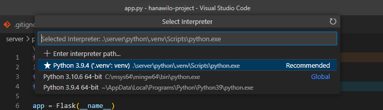
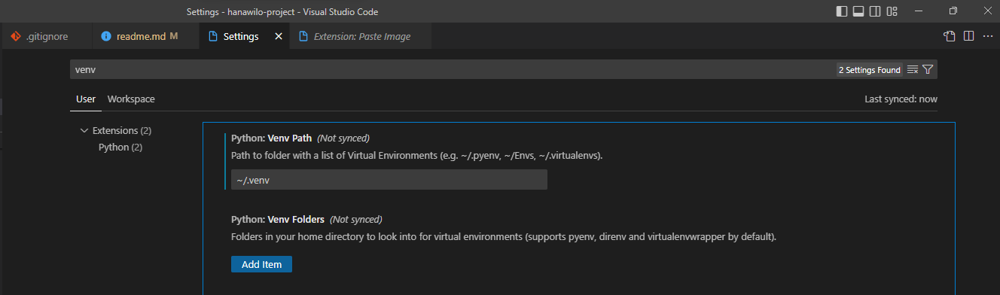
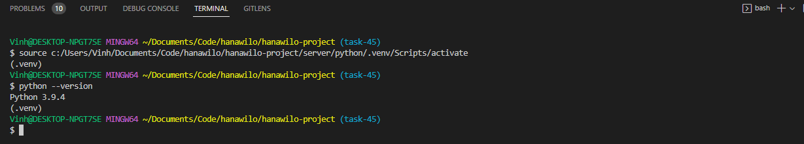
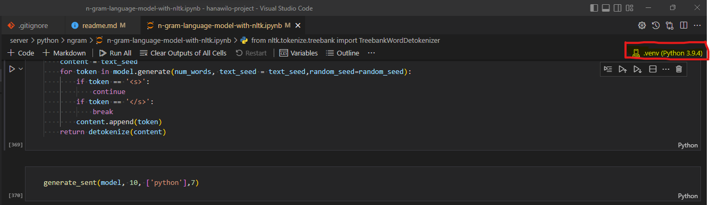
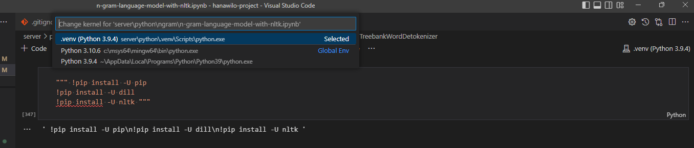

# Setup

## 1. Install Python

https://www.python.org/downloads/

## 2. Install Python extension for VS Code

https://marketplace.visualstudio.com/items?itemName=ms-python.python

## 3. Install Jupyter notebook extension

https://marketplace.visualstudio.com/items?itemName=ms-toolsai.jupyter

## Additional tutorials from VS Code

https://code.visualstudio.com/docs/python/python-tutorial
https://code.visualstudio.com/docs/datascience/jupyter-notebooks

## 4. Python Virtual Environment

https://docs.python.org/3/library/venv.html  
https://realpython.com/python-virtual-environments-a-primer/

### 1. Navigate to `/server/python`

### 2. Create .venv folder with:

```sh
python -m venv .venv
```

### 3. Activate virtual environment in vscode with **Python: Select Interpreter** command in VS Code


If VS Code does not show the .venv interpreter path, add `~/.venv` to **Python: Venv Path** in VS Code settings. **And restart VS Code!**



Open a new terminal instance and you should see `(.venv)` above the command prompt:

The virtual environment is now active.

### 4. Install required packages with `pip`

```sh
pip install -r requirements.txt
```

Similar to npm, pip is the package manager of choice for Python modules. The `requirements.txt` is like `package.json` for npm.

### 5. You should now be able to run the `.py` Python script files with:

```sh
python filename.py
```

### 6. For Juypter notebooks (`.ipynb`) select .venv interpreter at top right of the notebook.

  


